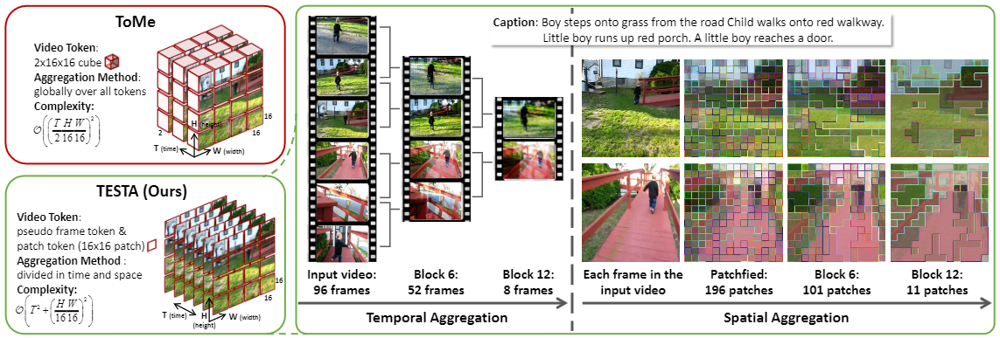
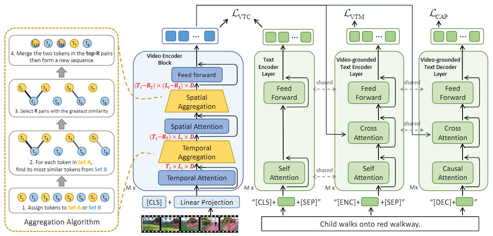

# TESTA: Temporal-Spatial Token Aggregation for Long-form Video-Language Understanding

> [**TESTA: Temporal-Spatial Token Aggregation for Long-form Video-Language Understanding**](https://arxiv.org/abs/2310.19060)<br>
> [Shuhuai Ren](https://renshuhuai-andy.github.io/), [Sishuo Chen](https://pkucss.github.io/), [Shicheng Li](https://lscpku.github.io/), [Xu Sun](https://xusun.org/index.htm), [Lu Hou](https://houlu369.github.io/)


[](https://arxiv.org/abs/2310.19060) 

[](https://paperswithcode.com/sota/video-retrieval-on-queryd?p=testa-temporal-spatial-token-aggregation-for)
[](https://paperswithcode.com/sota/video-retrieval-on-condensed-movies?p=testa-temporal-spatial-token-aggregation-for)
[](https://paperswithcode.com/sota/video-retrieval-on-didemo?p=testa-temporal-spatial-token-aggregation-for)
[](https://paperswithcode.com/sota/video-question-answering-on-activitynet-qa?p=testa-temporal-spatial-token-aggregation-for)
[](https://paperswithcode.com/sota/video-retrieval-on-activitynet?p=testa-temporal-spatial-token-aggregation-for)

# :rocket: News
* **(Oct 29, 2023)** 
  * Codes for video pre-training, video qa, video-paragraph retrieval.
  * Checkpoints of pre-trained TESTA-base model.
* **(Oct 8, 2023)** 
  * Our paper has been accepted by EMNLP 2023 (Findings).
<hr />

## Highlights


## Main Contributions

1) We introduce an efficient method named TESTA (TEmporal-Spatial Token Aggregation) for long-form video understanding. TESTA progressively aggregates similar visual tokens during video encoding, which can reduce the number of visual tokens by 75% and thus accelerate video encoding.
2) Building upon TESTA, we introduce a pre-trained video-language model equipped with a divided space-time token aggregation module in each video encoder block.
3) Experimental results on five datasets for paragraph-to-video retrieval and long-form VideoQA tasks show that, TESTA improves computing efficiency by 1.7 times, and achieves significant performance gains from its scalability in processing longer input frames, e.g., +13.7 R@1 on QuerYD and +6.5 R@1 on Condensed Movie.



Currently, the repository contains the code for pre-training a general-purpose video-language model and fine-tuning it on downstream video understanding tasks including video-paragraph retrieval and VideoQA.

## Installation

To install the dependencies, run
```bash
# create 
conda env create -f environment.yml
# activate
conda activate testa
```

## Data preparation
Please follow the instructions at [DATASETS.md](docs/DATASETS.md) to prepare all datasets.

## Models

### Pre-trained model

zero-shot performance (32 frames):

| Model                 | QuerYD R@1 | DiDeMo R@1 | ActivityNet Caption R@1 | GFLOPs | Checkpoint                                                                                             |
|-----------------------|------------|------------|-------------------------|--------|--------------------------------------------------------------------------------------------------------|
| TESTA-base (ViT-B/16) | 64.4       | 64.9       | 37.1                    | 786    | [testa_model_base_pretrain.pth](https://huggingface.co/ShuhuaiRen/TESTA_model_base_pretrain/tree/main) |

### Fine-tuned model

To be uploaded...

## Training and Evaluation
Please refer to the [RUN.md](docs/RUN.md) for detailed instructions on training, evaluating and reproducing the results.

## Todo list
- [ ] Upload fine-tuned checkpoints
- [ ] Add visualization code
- [ ] Add demos

## Acknowledgement
The codebase relies on resources from [BLIP](https://github.com/salesforce/BLIP), [ToMe](https://github.com/facebookresearch/ToMe),and [TimeSFormer](https://github.com/facebookresearch/TimeSformer). We thank the original authors for their open-sourcing.
